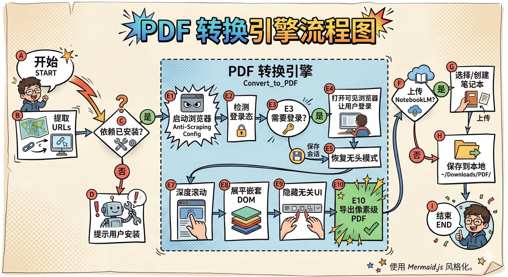

# @url-to-pdf Skill

将网页 URL 高质量转换为 PDF 文件的专业技能，支持一键上传到 Google NotebookLM。

## 工作流程



## 核心功能

| 功能 | 描述 |
|------|------|
| 🏥 **自愈式诊断** | 自动检测并修复环境问题 (uv, nlm, playwright) |
| 🔐 **Bootstrap 登录 + 后续无头** | 首次或会话过期时自动切到可见浏览器完成登录 bootstrap，保存会话后恢复无头批量导出 |
| 🥷 **反爬虫规避** | 伪装 WebDriver 指纹，配置真实 User-Agent，防止 cloudflare/安全拦截 |
| 📜 **深度完整捕获** | 智能识别自定义滚动容器 (如 Simplebar)，滚动触发所有懒加载内容，递归解除 DOM 高度限制 (flex, overflow)，确保从顶到底的完整打印 (支持 10MB+ PDF) |
| 🧹 **纯净打印模式** | 自动注入 CSS 隐藏导航栏、侧边栏、悬浮 footer 等干扰元素，还原纯净阅读体验 |
| 🚀 **零配置上传** | 通过 `notebooklm-mcp-cli` 直接 HTTP 对接 NotebookLM |
| 📁 **智能路径管理** | 无硬编码路径，跨用户账户无缝工作 |

## 工作原理

1. **Doctor 检查**: 技能首先运行诊断，确保所有工具就绪
2. **PDF 生成**: Chromium 渲染页面并保存为 PDF 到 `~/Downloads/PDF/`
3. **NotebookLM 集成**:
   - 列出当前笔记本列表
   - 提示选择目标笔记本或创建新笔记本
   - 通过 HTTP API 即时上传文件

## 技术亮点

### 1. 多模式登录检测
- **Broad 模式** (无会话): 检测"登录/注册"等关键词
- **Strict 模式** (有会话): 仅检测"未登录/请登录"等明确状态
- **防误判**: 即使导航栏有"登录"按钮，已登录用户也不会被拦截

### 2. 智能滚动容器识别
- 自动查找最大滚动容器 (Simplebar 等自定义滚动)
- 递归向上遍历 DOM，解除 flex/overflow 高度限制
- 确保完整捕获无限滚动页面

### 3. 安全的 UI 隐藏策略
- 使用 token 级别匹配 (避免误杀如 `use-femenu`)
- 白名单保护: `body`、`main`、`article`、`#js_content` 等核心内容
- 支持微信等国内平台特殊 class 命名

### 4. 会话持久化
- 登录后默认按站点保存 `storage_state` 到 `~/.url-to-pdf/profiles/<site>/storage_state.json`
- 后续运行自动加载 Cookie，无需重复登录
- 会话过期时自动重新走一次 bootstrap 登录

## 首次使用建议

为了让第一次使用尽量顺滑，推荐优先使用一条固定安装路径，而不是在系统 Python 上反复试错：

```bash
python3 -m venv .venv
source .venv/bin/activate
python -m pip install -U pip
python -m pip install playwright
python -m playwright install chromium
```

建议把“首次登录 bootstrap”理解成初始化步骤：

- 第一次访问需要登录的网站时，打开可见浏览器完成登录
- 默认按站点保存登录态到 `~/.url-to-pdf/profiles/<site>/storage_state.json`
- 同时维护站点级浏览器目录 `~/.url-to-pdf/profiles/<site>/browser_profile/`
- 后续默认无头运行
- 会话过期时，再自动重新 bootstrap 一次
- 本地交互式环境可以直接走自动 bootstrap
- Claude Code / 非交互环境更推荐使用“用户回复已登录 + fallback 校验”的显式确认流

如果你只想先初始化登录态，也可以单独运行：

```bash
python3 scripts/run.py bootstrap_login.py <需要登录的网站 URL>
```

如果你在 Claude Code 里使用，推荐这样做：

```bash
python3 scripts/run.py auth_manager.py begin <需要登录的网站 URL>
```

浏览器里完成登录后，在对话里回复“已登录”，再执行：

```bash
python3 scripts/run.py auth_manager.py confirm
```

更推荐的使用方式是始终通过统一入口运行脚本：

```bash
python3 scripts/run.py doctor.py --json
python3 scripts/run.py convert_to_pdf.py https://example.com
```

`run.py` 会自动：

- 创建 `.venv`
- 安装 Playwright Python 包
- 安装 Chromium 浏览器
- 再执行目标脚本

## 安装方式

### 通过 skills.sh / OpenSkills 安装

如果你的环境支持 `skills` CLI，可以直接从 GitHub 安装：

```bash
npx skills add https://github.com/biniendafeliupv187/url-to-pdf
```

### 手动安装

也可以将技能文件夹添加到你的 agentic 环境中。首次运行时会通过内置诊断工具引导安装依赖 (`uv`, `playwright`, `nlm`)。

## 使用方法

告诉 agent:
> `@/url-to-pdf [URL]`

示例:
> `@/url-to-pdf https://juejin.cn/post/6844903448337448974`

---

*为专业研究工作流打造*
