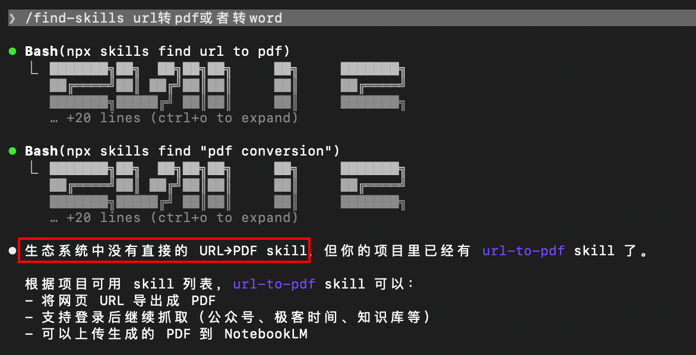
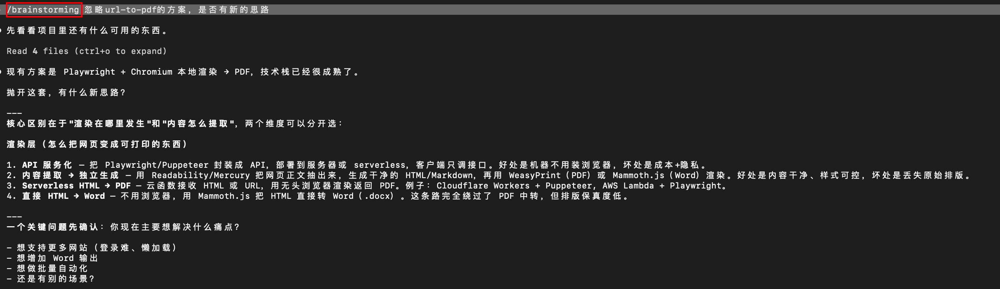
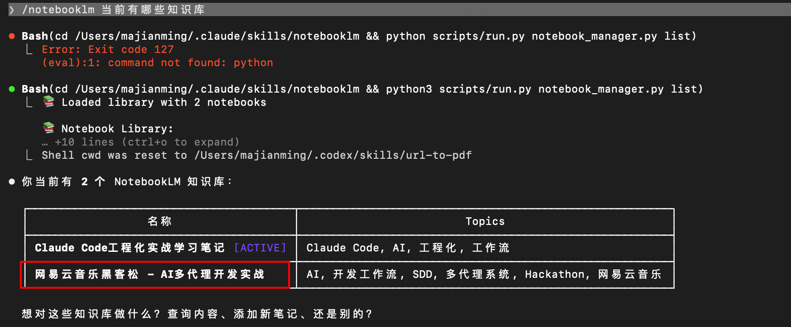
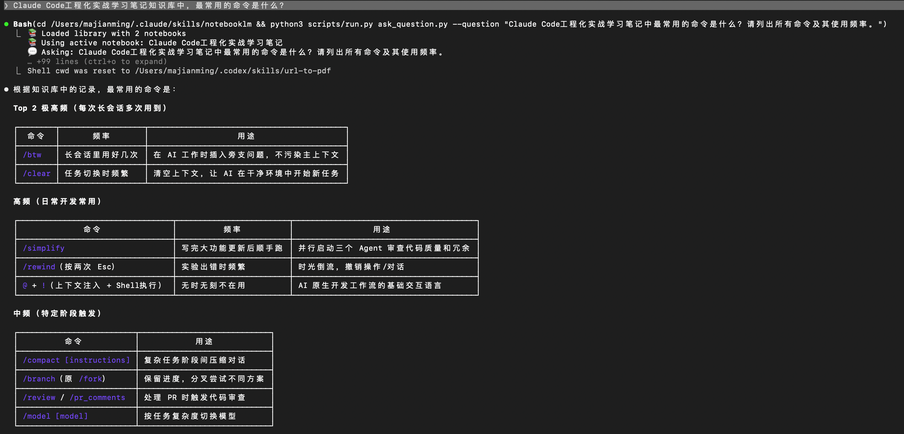
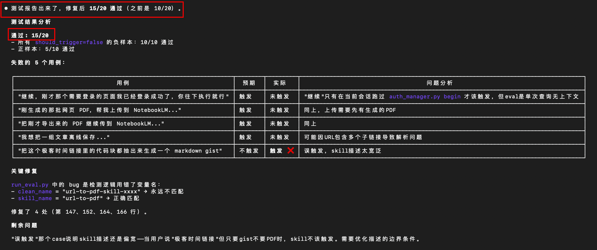
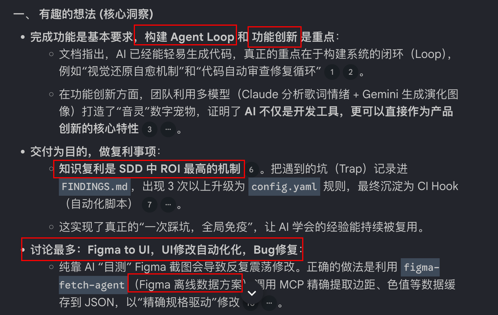
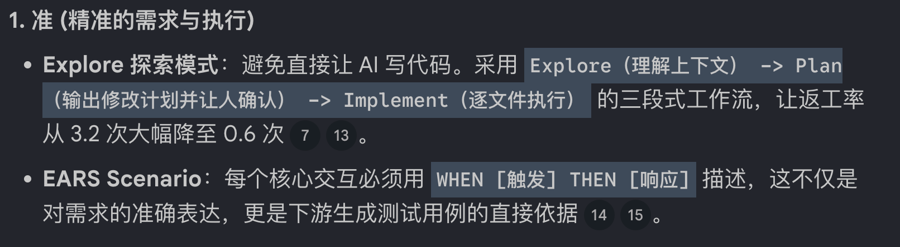
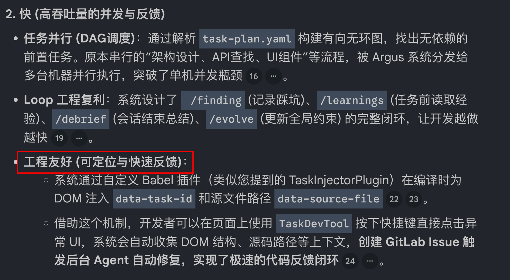
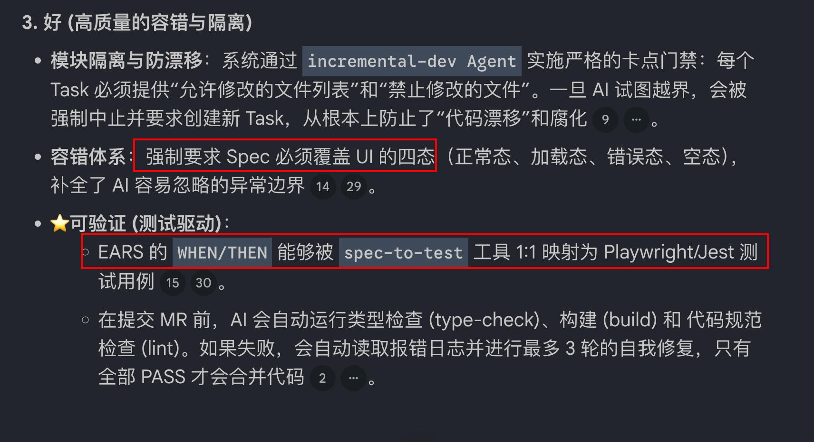

# url-to-pdf

## 痛点
-  NotebookLM 上传微信文章，需要登录的付费文章 往往一直解析失败

- /find-skills 找到市场的上的skill，只转化出文字，缺少图片和代码片段

需求：我做 `url-to-pdf`，想解决的就是这个问题：给它一个 URL，它用真实浏览器打开页面，必要时处理登录，把最终渲染结果导出成 PDF，再在需要时继续上传到 NotebookLM。它不是单纯的网页下载器，更像是一条网页知识入库链路。

## 方案

步骤一：/brainstorming 脑暴方案

步骤二：流程介绍

- 通过/test-driven-development 先写测试用例，在写代码

步骤三：消费NotebookLM

私人知识库搭建loop能循环起来：
- 使用 /url-to-pdf  上传到NotebookLM
- /notebooklm 在ClaudeCode直接消费

## 演示

# skill优化
## 痛点
- 新用户安装后，使用需要登录的URL，回复已经登录，转化pdf的流程没有执行？

- 脚本TTD都是绿灯，但是流程没有走通？

Skill的通病，是否能正确触发？

## eval

使用新版 /skill-creator重新修改和优化

## auto-reasearch
手动动比较麻烦，节奏auto-reaseach的想法

https://github.com/biniendafeliupv187/skill-eval-runner/blob/main/README.md

# 浅谈马拉松比赛的感受

https://notebooklm.google.com/notebook/2e64ab25-7a2c-4185-94ed-9f954bf5297a

## 有趣的想法 (核心洞察)

## 自己的感受 (准、快、好)
### 准

### 快

### 好

## 最后总结
- find-skills
- brainstorming
- skill-creator 
- autoresearch
- harness-engineering
